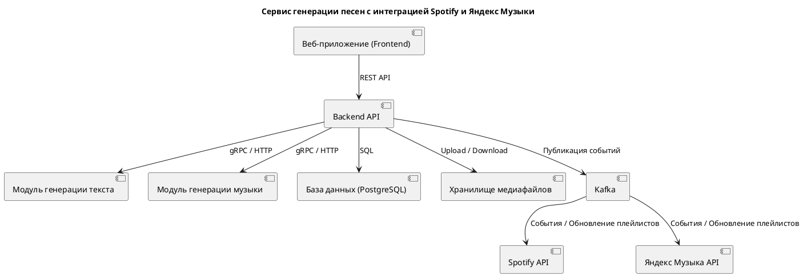

# Пример компонентной диаграммы_2

```plantuml
@startuml
title Сервис генерации песен с интеграцией Spotify и Яндекс Музыки

' Определяем компоненты
component "Веб-приложение (Frontend)" as FE
component "Backend API" as API
component "Модуль генерации текста" as LyricsGen
component "Модуль генерации музыки" as MusicGen
component "База данных (PostgreSQL)" as DB
component "Хранилище медиафайлов" as MediaStore
component "Kafka" as Kafka
component "Spotify API" as Spotify
component "Яндекс Музыка API" as YandexMusic

' Связи
FE --> API : REST API
API --> LyricsGen : gRPC / HTTP
API --> MusicGen : gRPC / HTTP
API --> DB : SQL
API --> MediaStore : Upload / Download
API --> Kafka : Публикация событий

' Интеграции
Kafka --> Spotify : События / Обновление плейлистов
Kafka --> YandexMusic : События / Обновление плейлистов

@enduml
```
