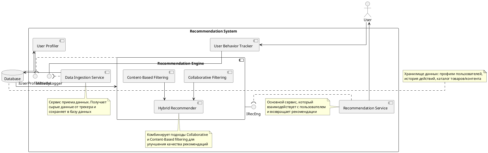

```plantuml
@startuml
skinparam linetype ortho

actor "User" as U
database "Database" as DB

rectangle "Recommendation System" {
    
    component "User Behavior Tracker" as UBT
    component "Data Ingestion Service" as DIS
    component "User Profiler" as UP
    component "Recommendation Service" as RS
    
    component "Recommendation Engine" as RE {
        component "Collaborative Filtering" as CF
        component "Content-Based Filtering" as CBF
        component "Hybrid Recommender" as HR
    }
    
    interface "IActivityLogger" as IAL
    interface "IRecEng" as IRE
    interface "IUserProfileReader" as IUPR

    U --> UBT
    UBT -down- IAL
    DIS -left-..( IAL
    DIS --> DB
    UP -down- IUPR
    UP <-- DB
    DB --> RE
    CF --> HR
    CBF --> HR
    RE -down- IRE
    RE -left-..( IUPR
    RS -right-..( IRE
    U <-- RS

    note bottom of HR
      Комбинирует подходы Collaborative
      и Content-Based filtering для
      улучшения качества рекомендаций
    end note 

    note left of RS
      Основной сервис, который
      взаимодействует с пользователем
      и возвращает рекомендации
    end note

    note bottom of DIS
      Сервис приема данных. Получает
      сырые данные от трекера и
      сохраняет в базу данных
    end note

}

note left of DB
      Хранилище данных: профили пользователей,
      история действий, каталог товаров/контента
    end note
@enduml
```
