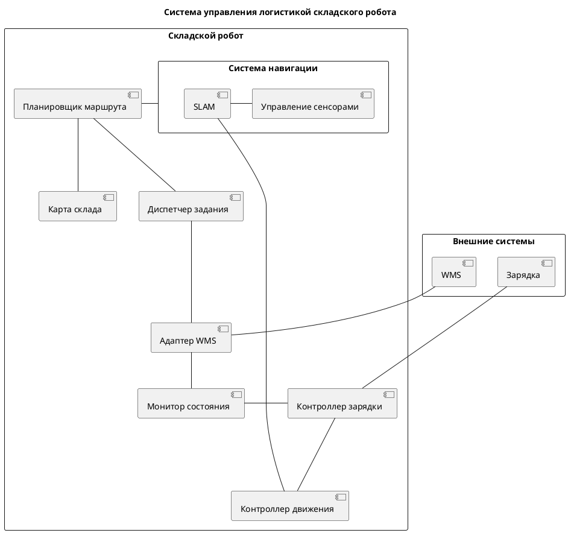

```plantuml
@startuml
title Система управления логистикой складского робота


rectangle "Складской робот" {


   component “Контроллер движения” as Movement
 component “Контроллер зарядки” as ChargingController
 component “Монитор состояния” as Conditions
 component “Адаптер WMS” as AdapterWMS
 component “Диспетчер задания” as Tasks
 component “Планировщик маршрута” as Pathfinding
component “Карта склада” as Map


rectangle "Система навигации" as Navigation {
  component "Управление сенсорами" as Sensors
  component  “SLAM” as SLAM
}
}
rectangle "Внешние системы" {
  component "Зарядка" as Charging
  component  “WMS” as WMS
}


WMS -- AdapterWMS
Charging-- ChargingController
ChargingController --–Movement
Movement -- SLAM
SLAM – Sensors
Navigation  – Pathfinding
Pathfinding--– Map
Pathfinding--– Tasks
Tasks –--AdapterWMS
AdapterWMS -- Conditions
Conditions – ChargingController


@enduml

```
