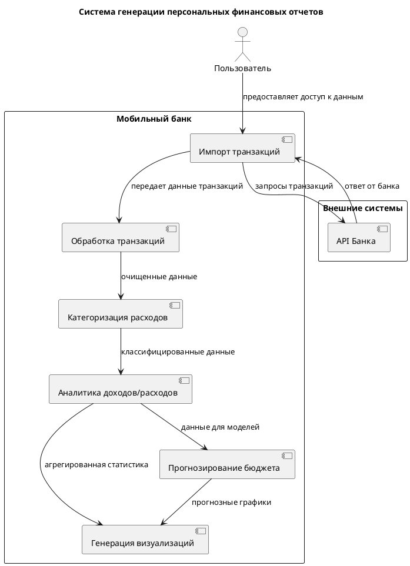

```plantuml
@startuml
title Система генерации персональных финансовых отчетов

actor "Пользователь" as User
rectangle "Мобильный банк" {
  
  [Импорт транзакций] as Import
  [Обработка транзакций] as Processing
  [Категоризация расходов] as Categorization
  [Аналитика доходов/расходов] as Analytics
  [Генерация визуализаций] as Visualization
  [Прогнозирование бюджета] as Forecasting
}

rectangle "Внешние системы" {
  [API Банка] as BankAPI
}

User --> Import : предоставляет доступ к данным
Import --> Processing : передает данные транзакций
Processing --> Categorization : очищенные данные
Categorization --> Analytics : классифицированные данные
Analytics --> Visualization : агрегированная статистика
Analytics --> Forecasting : данные для моделей
Forecasting --> Visualization : прогнозные графики

Import --> BankAPI : запросы транзакций
BankAPI --> Import : ответ от банка
@enduml
```
