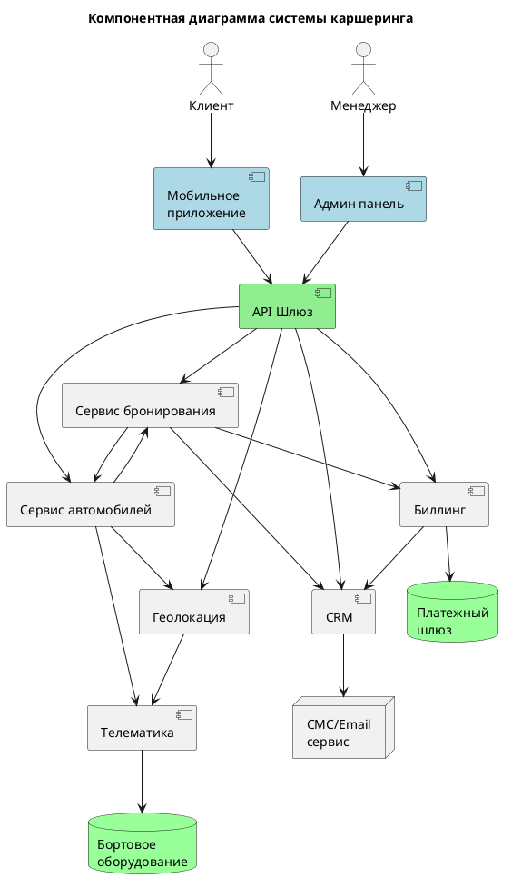

```plantuml
@startuml
title  Компонентная диаграмма системы каршеринга

' --- ВНЕШНИЕ СУЩНОСТИ ---
actor "Клиент" as Client
actor "Менеджер" as Manager
database "Платежный\nшлюз" as Payment #99FF99
database "Бортовое\nоборудование" as Car #99FF99
node "СМС/Email\nсервис" as Notifications

' --- ОСНОВНЫЕ КОМПОНЕНТЫ СИСТЕМЫ ---
component "Мобильное\nприложение" as App #lightblue
component "Админ панель" as Admin #lightblue
component "API Шлюз" as Gateway #lightgreen

component "Сервис бронирования" as Booking
component "Сервис автомобилей" as Vehicles
component "Биллинг" as Billing
component "CRM" as CRM

component "Геолокация" as Geo
component "Телематика" as Telematics

' --- СВЯЗИ МЕЖДУ КОМПОНЕНТАМИ ---
Client --> App
Manager --> Admin

App --> Gateway
Admin --> Gateway

Gateway --> Booking
Gateway --> Vehicles
Gateway --> Billing
Gateway --> CRM
Gateway --> Geo

Booking --> Vehicles
Booking --> Billing
Booking --> CRM

Vehicles --> Telematics
Vehicles --> Geo

Telematics --> Car
Billing --> Payment
CRM --> Notifications

Geo --> Telematics

' --- ДОПОЛНИТЕЛЬНЫЕ ВАЖНЫЕ СВЯЗИ ---
Billing --> CRM
Vehicles --> Booking

@enduml
```
