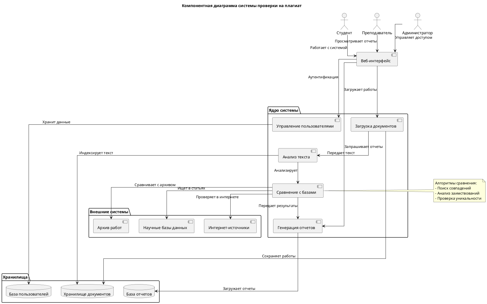

```plantuml
@startuml
skinparam linetype ortho
title Компонентная диаграмма системы проверки на плагиат
actor Студент
actor Преподаватель
actor Администратор
component "Веб-интерфейс" as UI
package "Ядро системы" {
    component "Управление пользователями" as Auth
    component "Загрузка документов" as Uploader
    component "Анализ текста" as Analyzer
    component "Сравнение с базами" as Comparator
    component "Генерация отчетов" as Reporter
}
package "Хранилища" {
    database "База пользователей" as UserDB
    database "Хранилище документов" as DocDB
    database "База отчетов" as ReportDB
}
package "Внешние системы" {
    component "Интернет-источники" as Web
    component "Научные базы данных" as Science
    component "Архив работ" as Archive
}
Студент --> UI : Работает с системой
Преподаватель --> UI : Просматривает отчеты
Администратор --> UI : Управляет доступом
UI ----> Auth : Аутентификация
UI ----> Uploader : Загружает работы
UI ----> Reporter : Запрашивает отчеты
Auth --> UserDB : Хранит данные
Uploader --> DocDB : Сохраняет работы
Reporter ----> ReportDB : Загружает отчеты
Uploader --> Analyzer : Передает текст
Analyzer --> Comparator : Анализирует
Comparator --> Web : Проверяет в интернете
Comparator --> Science : Ищет в статьях
Comparator --> Archive : Сравнивает с архивом
Comparator --> Reporter : Передает результаты
Analyzer --> DocDB : Индексирует текст
note right of Comparator
Алгоритмы сравнения:
- Поиск совпадений
- Анализ заимствований
- Проверка уникальности
end note
@enduml
```