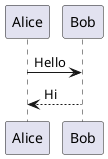

# Проверка рендера PlantUML

## Диаграмма 1



## Диаграмма 2
```
@startuml
actor User
User -> System: Запрос
System --> User: Ответ
@enduml
```

## Диаграмма 3
```
@startuml
class Car {
  +String model
  +drive()
}
class Engine
Car --> Engine
@enduml
```
